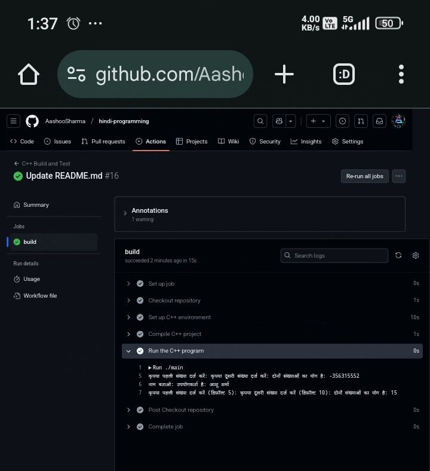
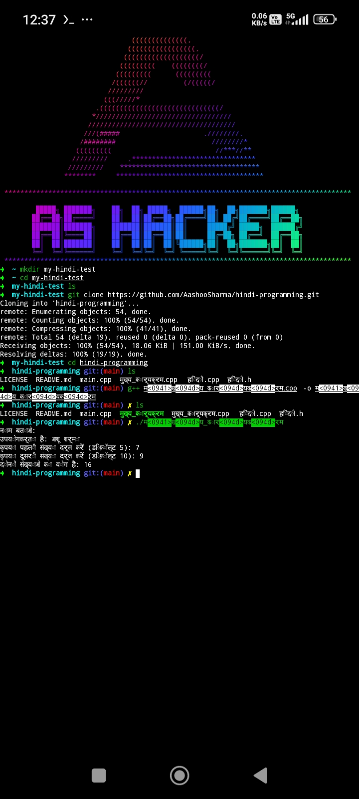

# Hindi Programming ( हिंदी प्रोग्रामिंग )

---

A C++ project that implements programming concepts using Hindi keywords and syntax. This project allows you to write C++ code using Hindi for keywords, functions, and other programming constructs. This can help non-English speakers understand programming concepts in their native language.


<p align="center">
    <br><b>🚀 हिंदी में प्रोग्रामिंग 🚀</b><br>
</p>
<p align="center"><a href="https://github.com/AashooSharma/hindi-programming"></a></p>


<h4 align="center">
    आपका स्वागत है <b>हिंदी में प्रोग्रामिंग</b> प्रोजेक्ट में, जो आपको प्रोग्रामिंग और कोडिंग हिंदी भाषा में सिखाने का एक अनोखा अनुभव प्रदान करता है।
</h4>

<p align="center">
    
    
    
    
    
    <a href="https://github.com/AashooSharma/hindi-programming/commits/main"> 
        
    </a>
    
    <a href="https://github.com/AashooSharma/hindi-programming/issues"> 
        
    </a>
    <a href="https://github.com/AashooSharma/hindi-programming"> 
        
    </a>
</p>


## Table of Contents

1. [Overview](#overview)
2. [Features](#features)
3. [Files Structure](#files-structure)
4. [Example Code](#example-code)
5. [Screenshots](#screenshots)
6. [References](#references)
7. [Credits](#credits)
8. [Contribution](#contribution)
9. [Support](#support)
10. [License](#license)
11. [Locally Run](#locally-run)

## Overview

This project introduces a unique approach to programming by using Hindi in C++ code. The goal is to replace the traditional English keywords and syntax with their Hindi equivalents. With this project, users can write their programs in Hindi while maintaining the same functionality as traditional C++ code.

## Features

- **Hindi Keywords:** Replaces C++ keywords like `int`, `main`, `if`, `return`, etc., with Hindi keywords.
- **Input and Output:** Allows users to use Hindi for input and output operations.
- **Control Structures:** Uses Hindi for `if`, `else`, `while`, `for`, etc.
- **Arithmetic Operations:** Provides functions with Hindi names for basic arithmetic operations like addition, subtraction, etc.

## Files Structure

```
hindi-programming/
│
├── हिंदी.h              # Hindi library with C++ functions and macros
├── मुख्य_कार्यक्रम.cpp   # Main program file
└── README.md            # Project documentation
```

## Example Code

Here is an example of how you can use the Hindi library in your C++ programs.

**मुख्य_कार्यक्रम.cpp**:
```cpp
#include "हिंदी.h"

पूर्णांक मुख्य() {
    पूर्णांक पहली_संख्या, दूसरी_संख्या, योग;
    स्ट्रिंग उपयोगकर्ता_नाम;

    // उपयोगकर्ता से नाम पूछना
    संदेश_दिखाएं << "नाम बताओ: ";
    स्ट्रिंग_लें(संख्या_दर्ज_करें, उपयोगकर्ता_नाम); // नाम के लिए इनपुट लेना

    // नाम दिखाना
    यदि (उपयोगकर्ता_नाम.empty()) {
        उपयोगकर्ता_नाम = "आशू शर्मा"; // अगर नाम नहीं दिया गया तो डिफ़ॉल्ट नाम "आशू शर्मा"
    }
    संदेश_दिखाएं << "उपयोगकर्ता है: " << उपयोगकर्ता_नाम << अंत_लाइन;

    // उपयोगकर्ता से पहली संख्या पूछना
    संदेश_दिखाएं << "कृपया पहली संख्या दर्ज करें (डिफ़ॉल्ट 5): ";
    यदि (!(संख्या_दर्ज_करें >> पहली_संख्या)) {
        पहली_संख्या = 5; // अगर इनपुट नहीं मिलता तो डिफ़ॉल्ट 5 लें
    }

    // उपयोगकर्ता से दूसरी संख्या पूछना
    संदेश_दिखाएं << "कृपया दूसरी संख्या दर्ज करें (डिफ़ॉल्ट 10): ";
    यदि (!(संख्या_दर्ज_करें >> दूसरी_संख्या)) {
        दूसरी_संख्या = 10; // अगर इनपुट नहीं मिलता तो डिफ़ॉल्ट 10 लें
    }

    // दो संख्याओं का योग करना
    योग = जोड़ें(पहली_संख्या, दूसरी_संख्या);

    // परिणाम दिखाना
    संदेश_दिखाएं << "दोनों संख्याओं का योग है: " << योग << अंत_लाइन;

    // हिंदी में लौटें
    लौटें 0;
}
```

## Screenshots

Here’s a screenshot of the program in Testing:

### Testing in GitHub actions:



### Testing in Termux Terminal:




## References

This project is inspired by a Python Hindi programming project I created back in June 2021. The core idea of replacing English programming keywords with Hindi was taken from that project, but this version is implemented in C++ to further explore the possibilities of non-English programming. You can check out the original Python version My Project Demo Video [Click Here 🎦](https://youtu.be/x2MGH6CvTIc?si=3LwFmLGLl6b7bamv).

[](https://youtu.be/x2MGH6CvTIc?si=3LwFmLGLl6b7bamv "Hindi Programming Project in Python")

## Credits

- **Aashoo Sharma** (Developer)  
  Portfolio: [AashooSharma.tech](https://aashoosharma.tech)  
  LinkedIn: [@aashooSharma](https://linkedin.com/in/aashooSharma)

## Contribution

Feel free to fork this repository and submit pull requests for improvements or fixes. Your contributions are welcome!

## Support

For any issues or questions, please open an issue on GitHub or reach out via email.

## License

This project is licensed under the [MIT License](LICENSE).

## Locally Run

To run this project on your local machine, follow these steps:

### Requirements:
- **C++ Compiler** (e.g., GCC or Clang)
- **Git** (for cloning the repository)
- **Text Editor** (e.g., VSCode, Sublime Text)

### Steps:

1. Requirements install:
   ```bash
   sudo apt-get update
   sudo apt-get install -y build-essential clang git
   ```
2. Clone the repository:
   ```bash
   git clone https://github.com/AashooSharma/hindi-programming.git
   ```

3. Navigate to the project directory:
   ```bash
   cd hindi-programming
   ```

4. Compile the code using a C++ compiler:
   ```bash
   g++ मुख्य_कार्यक्रम.cpp -o मुख्य_कार्यक्रम
   ```

5. Run the program:
   ```bash
   ./मुख्य_कार्यक्रम
   ```

6. Follow the on-screen prompts to input the values and see the output in Hindi.


### Example Output:

```
नाम बताओ: 
उपयोगकर्ता है: आशू शर्मा
कृपया पहली संख्या दर्ज करें (डिफ़ॉल्ट 5): 
कृपया दूसरी संख्या दर्ज करें (डिफ़ॉल्ट 10): 
दोनों संख्याओं का योग है: 15
```
